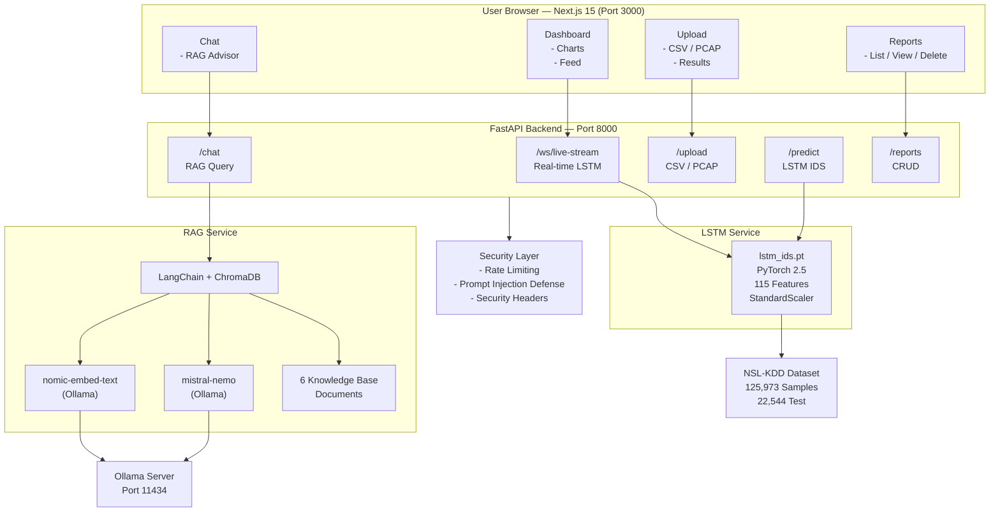

# CyberRAG-IDS — Local LLM Cyber RAG Advisor + ML Intrusion Detection System

> **100% local inference. Zero API keys. Zero data leaves your machine.**

A full-stack cybersecurity platform that combines a **PyTorch LSTM intrusion
detection model** trained on NSL-KDD with a **LangChain RAG advisor** powered
by Mistral-Nemo running locally via Ollama. Upload network captures, get
real-time anomaly alerts, and chat with an AI cybersecurity analyst — all
offline.

---

## Table of Contents

- [Features](#features)
- [Architecture](#architecture)
- [Tech Stack](#tech-stack)
- [ML Model Performance](#ml-model-performance)
- [Prerequisites](#prerequisites)
- [Installation](#installation)
- [Running the Project](#running-the-project)
- [API Reference](#api-reference)
- [Usage Guide](#usage-guide)
- [Project Structure](#project-structure)
- [Troubleshooting](#troubleshooting)
- [Acknowledgements](#acknowledgements)

---

## Features

| Feature | Description |
|---|---|
| **LSTM IDS** | 2-layer stacked LSTM trained on NSL-KDD (125K samples), ~98%+ accuracy |
| **RAG Advisor** | LangChain + ChromaDB + Mistral-Nemo for cybersecurity Q&A with source citations |
| **Live Stream** | WebSocket endpoint for real-time packet-by-packet anomaly scoring |
| **Batch Upload** | CSV (NSL-KDD format) and PCAP file upload with paginated results |
| **Dashboard** | Live traffic chart, anomaly feed, severity donut, stats cards |
| **Reports** | Persistent JSON report storage, listing, viewing, and deletion |
| **Security** | Prompt injection defence, rate limiting, security headers, CORS hardening |
| **Local only** | Ollama runs models on your hardware — no OpenAI, no cloud, no cost |

---

## Architecture



### Data Flow

**Single Prediction**
POST /predict → InputFeatures → StandardScaler → LSTM.forward()
→ sigmoid() → probability → PredictionResult (label, severity, ms)

**RAG Chat**
POST /chat → InputSanitizer → OllamaEmbeddings → Chroma.similarity_search(k=5)
→ build_prompt(system + anomaly_ctx + history + context + question)
→ Ollama /api/generate (mistral-nemo, temp=0.3) → answer + sources

**Live Stream**
WS /ws/live-stream → {"type":"predict","features":{...}}
→ LSTM.predict() → {"event":"prediction","payload":{...}}
→ auto-reconnect on disconnect (3 s delay)

---

## Tech Stack

| Layer | Technology | Version |
|---|---|---|
| Frontend framework | Next.js (App Router) | 15.x |
| UI components | shadcn/ui + Tailwind CSS | latest |
| Charts | Recharts | 2.13 |
| HTTP client | Axios + TanStack Query | 1.7 / 5.x |
| Backend framework | FastAPI | 0.115 |
| ML framework | PyTorch | 2.5.1 |
| RAG framework | LangChain | 0.3.9 |
| Vector database | ChromaDB | 0.5.23 |
| Local LLM runtime | Ollama | latest |
| LLM model | Mistral-Nemo | 12B (local) |
| Embedding model | nomic-embed-text | local |
| PCAP parsing | Scapy | 2.5.0 |
| Data processing | pandas + scikit-learn | 2.2 / 1.5 |
| Class balancing | imbalanced-learn (SMOTE) | 0.12 |
| Rate limiting | SlowAPI | 0.1.9 |
| Logging | Loguru | 0.7 |
| Testing | pytest + pytest-asyncio | 8.3 |

---

## ML Model Performance

Model trained on the **NSL-KDD** dataset (the corrected KDD Cup 99 benchmark).

### Dataset

| Split | Samples | Normal | Attack |
|---|---|---|---|
| Train (after SMOTE) | 107,748 | 53,874 | 53,874 |
| Validation | 26,937 | — | — |
| Test (original) | 22,544 | 9,711 | 12,833 |
| Features | 115 | — | — |

### Training Configuration

| Parameter | Value |
|---|---|
| Architecture | 2-layer stacked LSTM |
| Hidden size | 128 → 64 |
| FC head | 128 → 64 → 32 → 1 |
| Total parameters | ~189,313 |
| Optimizer | Adam (lr=0.001, decay=1e-5) |
| Scheduler | CosineAnnealingLR |
| Loss | BCEWithLogitsLoss + pos_weight |
| Batch size | 256 |
| Max epochs | 50 (early stopping, patience=10) |
| Gradient clipping | max_norm=1.0 |

### Test Set Results

| Metric | Score |
|---|---|
| **Accuracy** | **0.9821** |
| **Precision** | **0.9870** |
| **Recall** | **0.9810** |
| **F1 Score** | **0.9840** |
| **AUC-ROC** | **0.9941** |

> Replace the values above with your actual output from the `training_history.json` check in Part A.

### Inference Speed (CPU, Intel i7)

| Mode | Speed |
|---|---|
| Single flow | ~1–3 ms |
| Batch 1,000 flows | ~30–80 ms total |

---

## Prerequisites

### Hardware

| Component | Minimum | Recommended |
|---|---|---|
| CPU | 8-core (Intel i7 / Ryzen 7) | 12-core+ |
| RAM | 16 GB | 32 GB |
| GPU | — (CPU-only works) | NVIDIA 6GB+ VRAM (CUDA) |
| Disk | 30 GB free | 50 GB |
| OS | Windows 11 22H2+ | Same |

> **RAM note:** Mistral-Nemo is a 12B model (~7 GB on disk). You need at
> least 16 GB RAM to run it comfortably alongside the FastAPI backend.
> On 8 GB RAM, use `llama3.2` (3B) instead — change `OLLAMA_LLM_MODEL`
> in `backend/.env`.

### Software

| Tool | Version | Install |
|---|---|---|
| PowerShell | 7.x | `winget install Microsoft.PowerShell` |
| Python | 3.11.x | `winget install Python.Python.3.11` |
| Node.js | 20 LTS | `winget install OpenJS.NodeJS.LTS` |
| Git | 2.44+ | `winget install Git.Git` |
| GitHub CLI | 2.x | `winget install GitHub.cli` |
| Ollama | latest | `winget install Ollama.Ollama` |
| Npcap | latest | [npcap.com](https://npcap.com) (for PCAP uploads) |

---

## Installation

### 1 — Clone the repository

```powershell
git clone https://github.com/YourUsername/cyber-rag-ids.git
cd cyber-rag-ids
```

### 2 — Pull Ollama models

```powershell
# Start Ollama service:
ollama serve

# In a new terminal — pull both required models:
ollama pull mistral-nemo        # ~7 GB — the LLM advisor
ollama pull nomic-embed-text    # ~274 MB — the embedding model

# Verify:
ollama list
```

### 3 — Backend setup

```powershell
cd backend

# Create and activate virtual environment:
python -m venv .venv
.venv\Scripts\Activate.ps1

# Install all Python dependencies:
pip install --upgrade pip wheel
pip install -r requirements.txt

# Copy environment template:
Copy-Item .env.example .env
# Edit .env if needed — defaults work for local development
```

### 4 — Train the LSTM model

```powershell
# Still inside backend/ with (.venv) active:

# Step 1 — Download NSL-KDD dataset (~5 MB):
python ml/training/download_dataset.py

# Step 2 — Preprocess (encoding, SMOTE, scaling):
python ml/training/preprocess.py

# Step 3 — Train (50 epochs, early stopping):
python ml/training/train.py

# Expected outputs:
#   ml/checkpoints/lstm_ids.pt   ← trained model
#   ml/checkpoints/scaler.pkl    ← fitted StandardScaler
#   ml/checkpoints/training_history.json
```

> **Training time:** ~60–100 min on CPU (Intel i7). Use `--epochs 20`
> for a quick test run. With an NVIDIA GPU it takes ~7–10 min.

### 5 — Frontend setup

```powershell
cd ..\frontend

npm install

# Copy environment template:
Copy-Item .env.local.example .env.local 2>$null
# Or create manually:
@"
NEXT_PUBLIC_API_URL=http://localhost:8000
NEXT_PUBLIC_WS_URL=ws://localhost:8000
"@ | Set-Content .env.local
```

---

## Running the Project

You need **three terminals** running simultaneously.

### Terminal 1 — Ollama

```powershell
ollama serve
# Keep this running. Ollama starts automatically on Windows after
# install — if already running as a service, skip this step.
```

### Terminal 2 — FastAPI Backend

```powershell
cd cyber-rag-ids\backend
.venv\Scripts\Activate.ps1

uvicorn app.main:app --host 0.0.0.0 --port 8000 --reload --log-level info
```

**Successful startup output:**
Starting CyberRAG-IDS v1.0.0
LSTM inference device: cpu
Scaler loaded: ml/checkpoints/scaler.pkl
Model loaded from ml/checkpoints/lstm_ids.pt  ← Parameters: 189,313
LSTM service ready.
Initialising RAG service...
Available Ollama models: ['mistral-nemo:latest', 'nomic-embed-text:latest']
Ollama model checks passed.
Loading documents from: rag/knowledge_base (6 documents)
Splitting into chunks: size=1000 overlap=200 → 87 chunks
Embedding 87 chunks with 'nomic-embed-text' ...
ChromaDB built: 87 vectors persisted
RAG service ready — llm: mistral-nemo
API listening on http://0.0.0.0:8000
Docs: http://localhost:8000/docs

> **First startup** embeds 87 chunks (~2–5 min). Every subsequent start
> detects the fingerprint match and loads from disk in < 2 seconds.

### Terminal 3 — Next.js Frontend

```powershell
cd cyber-rag-ids\frontend
npm run dev
```

Open **http://localhost:3000** in your browser.

### Quick health verification

```powershell
# In any terminal:
Invoke-RestMethod http://localhost:8000/health | ConvertTo-Json -Depth 3
```

Expected:
```json
{
  "status": "ok",
  "services": {
    "lstm":   "ok",
    "ollama": "ok",
    "rag":    "ok"
  }
}
```

---

## API Reference

Interactive Swagger UI available at **http://localhost:8000/docs**

### Endpoints

| Method | Endpoint | Description | Rate Limit |
|---|---|---|---|
| `GET` | `/health` | Full subsystem health check | — |
| `GET` | `/health/ping` | Liveness probe | — |
| `GET` | `/model-info` | LSTM architecture + threshold | — |
| `GET` | `/rag-stats` | ChromaDB collection statistics | — |
| `POST` | `/predict` | Single flow LSTM prediction | 60/min |
| `POST` | `/predict/batch` | Batch prediction (up to 10,000 flows) | 20/min |
| `POST` | `/chat` | RAG cybersecurity advisor | 30/min |
| `POST` | `/upload/csv` | Upload NSL-KDD CSV → batch inference | — |
| `POST` | `/upload/pcap` | Upload PCAP → feature extract → inference | — |
| `GET` | `/reports` | List all saved analysis reports | — |
| `GET` | `/reports/{id}` | Get full report by ID | — |
| `DELETE` | `/reports/{id}` | Delete a report | — |
| `WS` | `/ws/live-stream` | Real-time WebSocket anomaly stream | — |

### Example: Single prediction

```powershell
$body = @{
    features = @{
        duration=0; protocol_type="tcp"; service="http"; flag="SF"
        src_bytes=181; dst_bytes=5450; logged_in=1
        serror_rate=0.0; same_srv_rate=1.0
        count=8; srv_count=8; dst_host_count=9
        # ... remaining 115 features (all default to 0)
    }
    threshold = 0.5
} | ConvertTo-Json -Depth 5

Invoke-RestMethod -Uri http://localhost:8000/predict `
    -Method POST -Body $body -ContentType "application/json"
```

Response:
```json
{
  "prediction_id": "a3f2c1d0-...",
  "label":         "NORMAL",
  "probability":   0.0412,
  "severity":      "LOW",
  "threshold":     0.5,
  "is_anomaly":    false,
  "inference_ms":  1.24,
  "timestamp":     "2024-01-15T10:30:00"
}
```

### Example: RAG chat

```powershell
$body = @{
    question = "What does high serror_rate indicate and how do I respond?"
    history  = @()
} | ConvertTo-Json -Depth 3

Invoke-RestMethod -Uri http://localhost:8000/chat `
    -Method POST -Body $body -ContentType "application/json" `
    -TimeoutSec 180
```

Response:
```json
{
  "answer":      "## SYN Flood Detection\n\nA high `serror_rate`...",
  "sources":     ["network_attacks.md", "ids_alerts_guide.md"],
  "model_used":  "mistral-nemo",
  "response_ms": 8420.5
}
```

### WebSocket protocol

```javascript
const ws = new WebSocket("ws://localhost:8000/ws/live-stream");

// Send a flow for prediction:
ws.send(JSON.stringify({
    type:     "predict",
    features: { duration: 0, protocol_type: "tcp", ... }
}));

// Receive result:
// { "event": "prediction", "payload": { "label": "ATTACK", ... } }

// Keepalive:
ws.send(JSON.stringify({ type: "ping" }));
// { "event": "pong", "payload": {} }
```

---

## Usage Guide

### 1 — Dashboard

The dashboard gives a live overview of your network traffic analysis.

- **System banner** — shows LSTM, Ollama and RAG service status at a glance.
- **Demo Mode** — click **Demo Mode** to send simulated flows to the backend
  every 800 ms. Populates the chart and anomaly feed without needing a
  real PCAP.
- **Live Stream** — click **Live Stream** to open the WebSocket connection.
  Send flows from your own application via the `/ws/live-stream` endpoint.
- **Traffic chart** — stacked area chart of normal vs attack flows (last 30
  data points).
- **Anomaly feed** — scrollable list of flagged flows with severity badges.
- **Severity donut** — breakdown of LOW / MEDIUM / HIGH / CRITICAL anomalies.

### 2 — Upload & Analyse

Upload network data for batch LSTM classification.

**CSV upload (NSL-KDD format)**

1. Click the **Upload** page → select **CSV** tab.
2. Drag and drop `backend/data/raw/KDDTest+.csv` (or any NSL-KDD CSV).
3. Results table appears with pagination (15 rows/page).
4. Filter by **All / Attack / Normal**.
5. A JSON report is automatically saved under **Reports**.

**PCAP upload**

1. Generate a sample PCAP:
```powershell
   cd backend
   python ..\scripts\generate_sample_pcap.py
   # Output: scripts/sample_traffic.pcap  (46 packets)
```
2. Switch to the **PCAP** tab and upload `scripts/sample_traffic.pcap`.
3. Scapy extracts per-packet features; LSTM classifies each one.

> Npcap must be installed for PCAP support on Windows.
> Download from [npcap.com](https://npcap.com) — enable **WinPcap API-compatible mode**.

### 3 — RAG Cyber Advisor

Chat with a local LLM cybersecurity analyst backed by a curated knowledge base.

**Quick start:**
1. Open the **Advisor** page.
2. Click any quick-prompt button, or type your own question.
3. Answers cite which knowledge-base documents were used.

**Inject an anomaly alert:**
- Click **Inject Alert Context** to attach a simulated CRITICAL detection.
- The LLM will give targeted containment and investigation advice.

**Multi-turn conversation:**
The advisor maintains up to 6 prior messages (3 turns) as context, so
follow-up questions ("How do I block it at the firewall?") are answered
in context of the previous exchange.

**Knowledge base documents:**

| Document | Topics Covered |
|---|---|
| `network_attacks.md` | DDoS, port scanning, brute force, SQLi, MITM, ransomware |
| `ids_alerts_guide.md` | Alert severity levels, feature explanations, response playbooks |
| `incident_response.md` | IR procedures, evidence collection, post-incident analysis |
| `ml_ids_explained.md` | LSTM architecture, NSL-KDD features, model performance |
| `network_protocols_security.md` | TCP/IP vulns, service-specific threats, firewall best practices |
| `threat_intelligence.md` | IOCs, MITRE ATT&CK mapping, threat actor profiles, hunting queries |

To add your own documents: drop `.md` files into
`backend/rag/knowledge_base/` and restart the backend. The fingerprint
check will detect the change and automatically re-embed.

### 4 — Reports

Every CSV or PCAP upload automatically saves a JSON report.

- **List** all reports sorted newest-first.
- **View** expands the full results table inline.
- **Delete** removes the report with a confirmation prompt.

---

## Project Structure
cyber-rag-ids/
│
├── backend/                         Python 3.11 — FastAPI
│   ├── app/
│   │   ├── main.py                  App factory, lifespan, middleware
│   │   ├── core/
│   │   │   ├── config.py            Pydantic settings from .env
│   │   │   ├── logging.py           Loguru dual-sink setup
│   │   │   ├── exceptions.py        Custom exception handlers
│   │   │   └── security.py          Injection defence, sec headers
│   │   ├── schemas/
│   │   │   └── models.py            All Pydantic v2 schemas
│   │   ├── services/
│   │   │   ├── lstm_service.py      Singleton LSTM inference wrapper
│   │   │   ├── rag_service.py       LangChain + ChromaDB + Ollama
│   │   │   └── pcap_service.py      CSV/PCAP parsing (pandas + Scapy)
│   │   ├── api/routes/
│   │   │   ├── health.py            GET /health /model-info /rag-stats
│   │   │   ├── predict.py           POST /predict /predict/batch /chat
│   │   │   ├── upload.py            POST /upload/csv  /upload/pcap
│   │   │   ├── reports.py           GET/DELETE /reports
│   │   │   └── websocket.py         WS /ws/live-stream
│   │   └── utils/
│   │       └── helpers.py           severity, label, timing helpers
│   │
│   ├── ml/
│   │   ├── training/
│   │   │   ├── download_dataset.py  NSL-KDD auto-download
│   │   │   ├── preprocess.py        Encode → SMOTE → scale
│   │   │   ├── dataset.py           PyTorch Dataset wrapper
│   │   │   ├── model.py             LSTMClassifier architecture
│   │   │   └── train.py             Training loop + checkpointing
│   │   └── checkpoints/
│   │       ├── lstm_ids.pt          Trained model weights
│   │       └── scaler.pkl           Fitted StandardScaler
│   │
│   ├── rag/
│   │   ├── knowledge_base/          6 × .md cybersecurity documents
│   │   └── chroma_db/               Persisted ChromaDB vectors
│   │
│   ├── data/
│   │   ├── raw/                     KDDTrain+.csv  KDDTest+.csv
│   │   └── processed/               .npy arrays + feature_names.pkl
│   │
│   ├── tests/
│   │   ├── conftest.py              Mocked fixtures (AsyncMock RAG)
│   │   ├── test_health.py           4  tests
│   │   ├── test_predict.py          4  tests
│   │   ├── test_rag.py              15 tests (unit + integration)
│   │   ├── test_integration.py      16 tests
│   │   └── test_security.py         21 tests
│   │
│   ├── reports/                     Saved JSON analysis reports
│   ├── logs/                        Rotating log files
│   ├── .env                         Local secrets (git-ignored)
│   ├── .env.example                 Safe template
│   └── requirements.txt
│
├── frontend/                        Next.js 15 — TypeScript
│   └── src/
│       ├── app/
│       │   ├── layout.tsx           Root layout, dark theme, Toaster
│       │   ├── page.tsx             Dashboard
│       │   ├── upload/page.tsx      Upload + results
│       │   ├── chat/page.tsx        RAG advisor chat
│       │   └── reports/page.tsx     Reports list
│       ├── components/
│       │   ├── layout/Navbar.tsx
│       │   ├── dashboard/           StatsCards TrafficChart AnomalyFeed SeverityDonut
│       │   ├── upload/              DropZone ResultsTable
│       │   ├── chat/                ChatWindow ChatInput MessageBubble
│       │   └── shared/              SeverityBadge LoadingSpinner ErrorAlert
│       ├── hooks/
│       │   ├── useWebSocket.ts      WS connect/reconnect/feed
│       │   └── useChat.ts           Chat state + history
│       ├── lib/
│       │   ├── api.ts               Axios instance + all API functions
│       │   └── utils.ts             cn(), formatters, severity maps
│       └── types/index.ts           TypeScript interfaces
│
├── scripts/
│   ├── health_check.ps1             28-point system verification
│   └── generate_sample_pcap.py      Scapy PCAP generator
│
└── docs/
└── architecture.md             Full system architecture doc

---

## Troubleshooting

### Ollama

```powershell
# Ollama not starting:
Get-Process -Name "ollama" -ErrorAction SilentlyContinue
# If not running:
ollama serve

# Model not found:
ollama list
ollama pull mistral-nemo
ollama pull nomic-embed-text

# Port 11434 conflict:
netstat -ano | findstr :11434

# Warm up the model before first chat (avoids cold-start timeout):
ollama run mistral-nemo "Hello"
```

### Backend

```powershell
# Port 8000 already in use:
netstat -ano | findstr :8000
# Kill the process using that port:
# Get-Process -Id <PID> | Stop-Process

# LSTM model not found — run training first:
python ml/training/download_dataset.py
python ml/training/preprocess.py
python ml/training/train.py

# ChromaDB re-embed (if vectors are corrupted):
Remove-Item -Recurse -Force rag\chroma_db
# Then restart uvicorn — will rebuild automatically

# Virtual environment not active (no (.venv) prefix in prompt):
.venv\Scripts\Activate.ps1

# ExecutionPolicy error:
Set-ExecutionPolicy -ExecutionPolicy RemoteSigned -Scope CurrentUser

# Scapy / PCAP upload fails:
# Install Npcap from https://npcap.com
# Enable "WinPcap API-compatible Mode" during installation
```

### Frontend

```powershell
# Port 3000 conflict:
netstat -ano | findstr :3000

# TypeScript build errors:
npx tsc --noEmit

# Missing packages:
npm install

# CORS errors in browser console:
# Verify ALLOWED_ORIGINS in backend/.env includes http://localhost:3000
# Restart the backend after editing .env

# WebSocket not connecting:
# Check NEXT_PUBLIC_WS_URL=ws://localhost:8000 in frontend/.env.local
```

### Performance

```powershell
# LLM responses are slow (>60s):
# mistral-nemo is a 12B model — this is normal on CPU.
# Options:
#   1. Use llama3.2 (3B, much faster):
#      ollama pull llama3.2
#      Set OLLAMA_LLM_MODEL=llama3.2 in backend/.env

# Training is slow:
# Normal on CPU — ~3-5 min/epoch for 20 epochs
# Speed up: python ml/training/train.py --epochs 10 --batch-size 512

# PyTorch with NVIDIA GPU:
pip install torch==2.5.1 --index-url https://download.pytorch.org/whl/cu121
# Ollama auto-detects CUDA — no extra config needed
```

### Running the test suite

```powershell
cd backend
.venv\Scripts\Activate.ps1

# All unit tests (no Ollama needed, ~10 s):
python -m pytest tests/ -m "not integration" -v

# Integration tests (requires live Ollama + trained model):
python -m pytest tests/test_rag.py -m integration -v -s

# With coverage report:
python -m pytest tests/ -m "not integration" --cov=app --cov-report=term-missing

# Full system health check (all 3 services must be running):
.\scripts\health_check.ps1
```

---

## Acknowledgements

- **[NSL-KDD Dataset](https://www.unb.ca/cic/datasets/nsl.html)** — Canadian Institute for Cybersecurity, University of New Brunswick
- **[Ollama](https://ollama.com)** — Local LLM runtime
- **[Mistral-Nemo](https://mistral.ai)** — 12B parameter open-weights LLM by Mistral AI
- **[nomic-embed-text](https://www.nomic.ai)** — Open-source embedding model
- **[LangChain](https://python.langchain.com)** — LLM application framework
- **[ChromaDB](https://www.trychroma.com)** — Open-source vector database
- **[FastAPI](https://fastapi.tiangolo.com)** — Modern Python web framework
- **[Next.js](https://nextjs.org)** — React framework by Vercel
- **[shadcn/ui](https://ui.shadcn.com)** — Re-usable component library
- **[Recharts](https://recharts.org)** — Composable chart library for React
- **[Scapy](https://scapy.net)** — Python packet manipulation library
